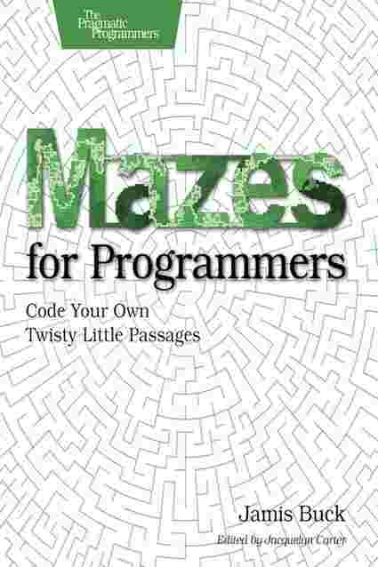
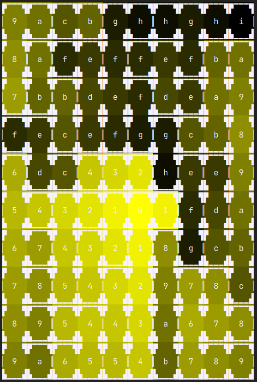

# mazes-kotlin

Kotlin implementations of the mazes code from "Mazes for Programmers" book (by Jamis Buck)



# Background

This code has been partially built using Test Driven Development, mainly around the domain and helper classes
(e.g., `Cell`, `Grid`, etc). The various algorithms (e.g., `Sidewinder`, `Wilsons` in the `algos` package)
have been rewritten from the original Ruby versions in the book.

Where possible, the same variable and function names have been used (changed only for stylistic conventions),
however I did start to look at using more idiomatic Kotlin in the latter parts of the Chapter 3 algorithms.

# Where is the ChunkyPNG?

The code examples from Jamis Buck's book introduced
the [Ruby ChunkPNG library](https://github.com/wvanbergen/chunky_png)
in Chapter 2 to render more pleasant looking, colourful mazes. A lazy GitHub search found 0 such libraries with
Kotlin/Java
bindings, so - necessity being the mother of invention - I turned back to a combination of Unicode characters and the
tasty [Mordant](https://github.com/ajalt/mordant) library to create nicer looking mazes, but without leaving the
terminal.

# Example Mazes

## A 10x10 grid with an optimal Dijkstra path from (0, 0) to (8, 6)

```
▛▔▔▔▜▛▔▔▔▜▛▔▔▔▜▛▔▔▔▜▛▔▔▔▜▛▔▔▔▜▛▔▔▔▜▛▔▔▔▜▛▔▔▔▜▛▔▔▔▜
▏ 0    1    2    3    4    5    6    7    8    9 ▕
▙   ▟▙   ▟▙▁▁▁▟▙▁▁▁▟▙▁▁▁▟▙▁▁▁▟▙   ▟▙▁▁▁▟▙▁▁▁▟▙   ▟
▛   ▜▛   ▜▛▔▔▔▜▛▔▔▔▜▛▔▔▔▜▛▔▔▔▜▛   ▜▛▔▔▔▜▛▔▔▔▜▛   ▜
▏   ▕▏   ▕▏                       ▕▏           a ▕
▙   ▟▙   ▟▙   ▟▙   ▟▙▁▁▁▟▙   ▟▙   ▟▙   ▟▙▁▁▁▟▙   ▟
▛   ▜▛   ▜▛   ▜▛   ▜▛▔▔▔▜▛   ▜▛   ▜▛   ▜▛▔▔▔▜▛   ▜
▏   ▕▏   ▕▏   ▕▏   ▕▏        ▕▏   ▕▏   ▕▏      b ▕
▙   ▟▙   ▟▙▁▁▁▟▙   ▟▙▁▁▁▟▙▁▁▁▟▙▁▁▁▟▙   ▟▙   ▟▙   ▟
▛   ▜▛   ▜▛▔▔▔▜▛   ▜▛▔▔▔▜▛▔▔▔▜▛▔▔▔▜▛   ▜▛   ▜▛   ▜
▏   ▕▏   ▕▏        ▕▏                  ▕▏   ▕▏ c ▕
▙▁▁▁▟▙   ▟▙▁▁▁▟▙▁▁▁▟▙▁▁▁▟▙▁▁▁▟▙   ▟▙   ▟▙   ▟▙   ▟
▛▔▔▔▜▛   ▜▛▔▔▔▜▛▔▔▔▜▛▔▔▔▜▛▔▔▔▜▛   ▜▛   ▜▛   ▜▛   ▜
▏        ▕▏                       ▕▏   ▕▏   ▕▏ d ▕
▙   ▟▙▁▁▁▟▙   ▟▙▁▁▁▟▙▁▁▁▟▙▁▁▁▟▙   ▟▙▁▁▁▟▙   ▟▙   ▟
▛   ▜▛▔▔▔▜▛   ▜▛▔▔▔▜▛▔▔▔▜▛▔▔▔▜▛   ▜▛▔▔▔▜▛   ▜▛   ▜
▏   ▕▏        ▕▏                  ▕▏        ▕▏ e ▕
▙▁▁▁▟▙▁▁▁▟▙   ▟▙   ▟▙▁▁▁▟▙▁▁▁▟▙▁▁▁▟▙▁▁▁▟▙   ▟▙   ▟
▛▔▔▔▜▛▔▔▔▜▛   ▜▛   ▜▛▔▔▔▜▛▔▔▔▜▛▔▔▔▜▛▔▔▔▜▛   ▜▛   ▜
▏             ▕▏   ▕▏                       ▕▏ f ▕
▙▁▁▁▟▙▁▁▁▟▙   ▟▙▁▁▁▟▙   ▟▙▁▁▁▟▙▁▁▁▟▙   ▟▙▁▁▁▟▙   ▟
▛▔▔▔▜▛▔▔▔▜▛   ▜▛▔▔▔▜▛   ▜▛▔▔▔▜▛▔▔▔▜▛   ▜▛▔▔▔▜▛   ▜
▏             ▕▏        ▕▏             ▕▏      g ▕
▙   ▟▙▁▁▁▟▙▁▁▁▟▙▁▁▁▟▙   ▟▙▁▁▁▟▙▁▁▁▟▙▁▁▁▟▙▁▁▁▟▙   ▟
▛   ▜▛▔▔▔▜▛▔▔▔▜▛▔▔▔▜▛   ▜▛▔▔▔▜▛▔▔▔▜▛▔▔▔▜▛▔▔▔▜▛   ▜
▏   ▕▏                  ▕▏      k    j    i    h ▕
▙▁▁▁▟▙   ▟▙▁▁▁▟▙   ▟▙   ▟▙   ▟▙   ▟▙   ▟▙▁▁▁▟▙   ▟
▛▔▔▔▜▛   ▜▛▔▔▔▜▛   ▜▛   ▜▛   ▜▛   ▜▛   ▜▛▔▔▔▜▛   ▜
▏        ▕▏        ▕▏   ▕▏   ▕▏   ▕▏   ▕▏        ▕
▙▁▁▁▟▙▁▁▁▟▙▁▁▁▟▙▁▁▁▟▙▁▁▁▟▙▁▁▁▟▙▁▁▁▟▙▁▁▁▟▙▁▁▁▟▙▁▁▁▟


```

## The above grid with one of the Dijkstra longest paths from (0, 0)

```
▛▔▔▔▜▛▔▔▔▜▛▔▔▔▜▛▔▔▔▜▛▔▔▔▜▛▔▔▔▜▛▔▔▔▜▛▔▔▔▜▛▔▔▔▜▛▔▔▔▜
▏ 0    1    2    3    4    5    6    7    8    9 ▕
▙   ▟▙   ▟▙▁▁▁▟▙▁▁▁▟▙▁▁▁▟▙▁▁▁▟▙   ▟▙▁▁▁▟▙▁▁▁▟▙   ▟
▛   ▜▛   ▜▛▔▔▔▜▛▔▔▔▜▛▔▔▔▜▛▔▔▔▜▛   ▜▛▔▔▔▜▛▔▔▔▜▛   ▜
▏   ▕▏   ▕▏                       ▕▏           a ▕
▙   ▟▙   ▟▙   ▟▙   ▟▙▁▁▁▟▙   ▟▙   ▟▙   ▟▙▁▁▁▟▙   ▟
▛   ▜▛   ▜▛   ▜▛   ▜▛▔▔▔▜▛   ▜▛   ▜▛   ▜▛▔▔▔▜▛   ▜
▏   ▕▏   ▕▏   ▕▏   ▕▏        ▕▏   ▕▏   ▕▏ c    b ▕
▙   ▟▙   ▟▙▁▁▁▟▙   ▟▙▁▁▁▟▙▁▁▁▟▙▁▁▁▟▙   ▟▙   ▟▙   ▟
▛   ▜▛   ▜▛▔▔▔▜▛   ▜▛▔▔▔▜▛▔▔▔▜▛▔▔▔▜▛   ▜▛   ▜▛   ▜
▏   ▕▏   ▕▏        ▕▏                  ▕▏ d ▕▏   ▕
▙▁▁▁▟▙   ▟▙▁▁▁▟▙▁▁▁▟▙▁▁▁▟▙▁▁▁▟▙   ▟▙   ▟▙   ▟▙   ▟
▛▔▔▔▜▛   ▜▛▔▔▔▜▛▔▔▔▜▛▔▔▔▜▛▔▔▔▜▛   ▜▛   ▜▛   ▜▛   ▜
▏        ▕▏                       ▕▏   ▕▏ e ▕▏   ▕
▙   ▟▙▁▁▁▟▙   ▟▙▁▁▁▟▙▁▁▁▟▙▁▁▁▟▙   ▟▙▁▁▁▟▙   ▟▙   ▟
▛   ▜▛▔▔▔▜▛   ▜▛▔▔▔▜▛▔▔▔▜▛▔▔▔▜▛   ▜▛▔▔▔▜▛   ▜▛   ▜
▏   ▕▏        ▕▏                  ▕▏      f ▕▏   ▕
▙▁▁▁▟▙▁▁▁▟▙   ▟▙   ▟▙▁▁▁▟▙▁▁▁▟▙▁▁▁▟▙▁▁▁▟▙   ▟▙   ▟
▛▔▔▔▜▛▔▔▔▜▛   ▜▛   ▜▛▔▔▔▜▛▔▔▔▜▛▔▔▔▜▛▔▔▔▜▛   ▜▛   ▜
▏             ▕▏   ▕▏ k    j    i    h    g ▕▏   ▕
▙▁▁▁▟▙▁▁▁▟▙   ▟▙▁▁▁▟▙   ▟▙▁▁▁▟▙▁▁▁▟▙   ▟▙▁▁▁▟▙   ▟
▛▔▔▔▜▛▔▔▔▜▛   ▜▛▔▔▔▜▛   ▜▛▔▔▔▜▛▔▔▔▜▛   ▜▛▔▔▔▜▛   ▜
▏             ▕▏      l ▕▏             ▕▏        ▕
▙   ▟▙▁▁▁▟▙▁▁▁▟▙▁▁▁▟▙   ▟▙▁▁▁▟▙▁▁▁▟▙▁▁▁▟▙▁▁▁▟▙   ▟
▛   ▜▛▔▔▔▜▛▔▔▔▜▛▔▔▔▜▛   ▜▛▔▔▔▜▛▔▔▔▜▛▔▔▔▜▛▔▔▔▜▛   ▜
▏   ▕▏ p    o    n    m ▕▏                       ▕
▙▁▁▁▟▙   ▟▙▁▁▁▟▙   ▟▙   ▟▙   ▟▙   ▟▙   ▟▙▁▁▁▟▙   ▟
▛▔▔▔▜▛   ▜▛▔▔▔▜▛   ▜▛   ▜▛   ▜▛   ▜▛   ▜▛▔▔▔▜▛   ▜
▏ r    q ▕▏        ▕▏   ▕▏   ▕▏   ▕▏   ▕▏        ▕
▙▁▁▁▟▙▁▁▁▟▙▁▁▁▟▙▁▁▁▟▙▁▁▁▟▙▁▁▁▟▙▁▁▁▟▙▁▁▁▟▙▁▁▁▟▙▁▁▁▟

```

## An image of a 10x10 grid showing cell visitation using the Wilson's algorithm.



# Running Tests

`./gradlew test`

[//]: # ()

[//]: # (# Running Demos)
